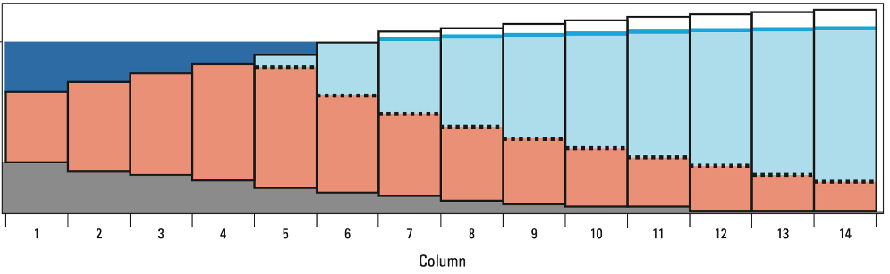

# modflow6-swi
Repository of materials used in the development of the sea water intrusion (SWI) package for MODFLOW 6 

The SWI Package for MODFLOW 6 is being developed on a [feature branch](https://github.com/christianlangevin/modflow6/tree/feat-swi-correction2).  Recent copies of the input instructions and executable for several different operating systems can be downloaded from a custom fork of the [modflow6 nightly build repository](https://github.com/christianlangevin/modflow6-nightly-build).

If you want to try the new SWI Package for MODFLOW 6, the following steps will get you started:

1.  Go to the custom fork of the modflow6 nightly build repository and view the [MODFLOW 6 SWI nightly build](https://github.com/christianlangevin/modflow6-nightly-build/actions/workflows/nightly-build-swi.yml).  Click on the most recent nightly build for SWI and download the proper artifact for your system.  Artifacts will be named according to operating system and will contain binary executables and documentation.  For Windows the artifact will be called `mf6.7.0.dev3_win64` or something similar.

2. Regenerate the flopy classes to match the capabilities in the feature branch using the following command.  Note that running this command will change your flopy installation as described in the [instructions for generating classes](https://flopy.readthedocs.io/en/latest/md/generate_classes.html).

```
python -m flopy.mf6.utils.generate_classes --owner christianlangevin --ref feat-swi-correction2
```

3.  There are a collection of notebooks in this repository that may provide inspiration.  There are also tests that are being developed as part of the SWI implementation in MODFLOW 6.  The names of these tests start with `test_gwf_swi` and can be found in the [autotest folder of the feature branch](https://github.com/christianlangevin/modflow6/tree/feat-swi-correction2/autotest).